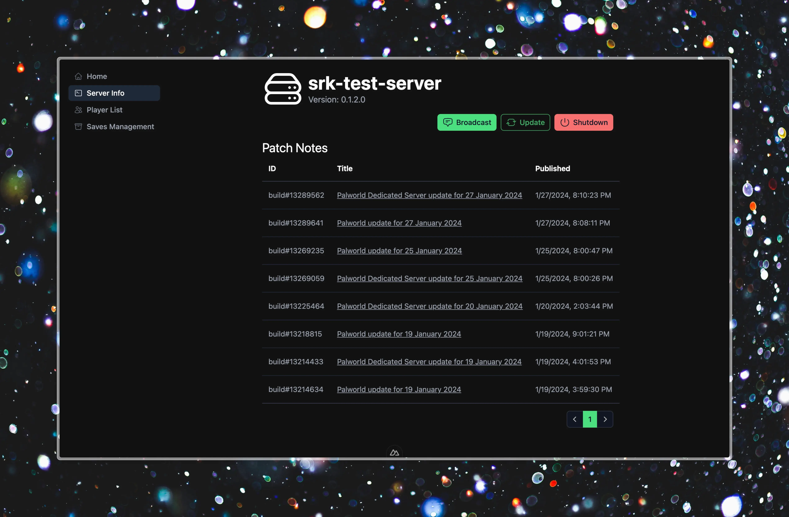
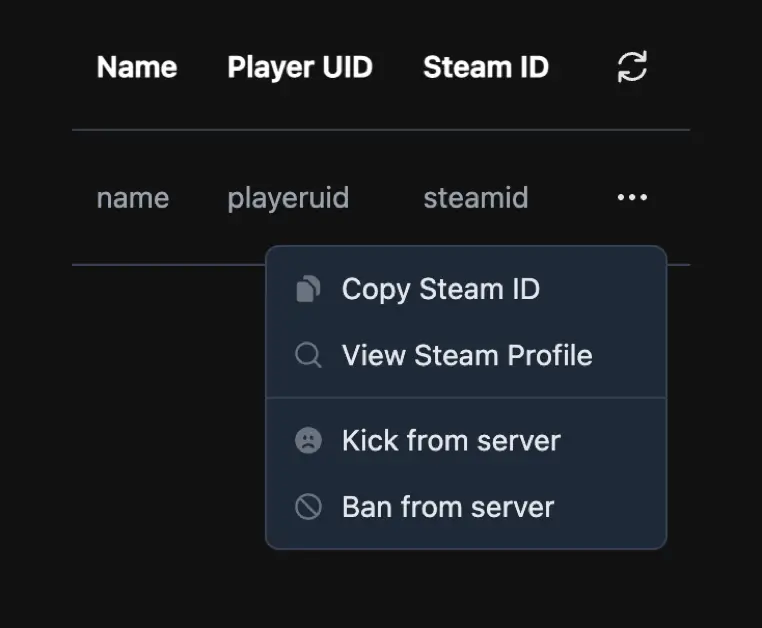

# PalBoard

A [Palworld](https://www.pocketpair.jp/palworld) dashboard, built with [Nuxt](https://nuxtjs.org/) and [Axum](https://github.com/tokio-rs/axum).



## Development

You need to install [Node.js](https://nodejs.org/) and [Bun](https://bun.sh/) to build frontend and [Rust](https://www.rust-lang.org/learn/get-started) to build gateway. Other Node.js package managers (e.g. `npm`, `yarn`) won't utilize `bun.lockb` and the build result may be different, so no guarantee.

```bash
# Allow .envrc if you use direnv
direnv allow
# or manually set environment variables, see .envrc for details

# Frontend
cd frontend
bun install
bun dev

# Gateway
cd gateway
RUST_LOG=debug cargo run
```

## Implemented Features



### RCON Commands

See description on <https://tech.palworldgame.com/server-commands>.

Following table is corresponding to v0.1.2.0.

| Command                             | Frontend | Gateway |
| ----------------------------------- | -------- | ------- |
| `/Shutdown {Seconds} {MessageText}` | 🚧       | ✔️      |
| `/DoExit`                           | 🚧       | ✔️      |
| `/Broadcast {MessageText}`          | 🚧       | ✔️      |
| `/KickPlayer {SteamID}`             | 🚧       | ✔️      |
| `/BanPlayer {SteamID}`              | 🚧       | ✔️      |
| `/TeleportToPlayer {SteamID}`       | 🚫       | 🚫      |
| `/TeleportToMe {SteamID}`           | 🚫       | 🚫      |
| `/ShowPlayers`                      | ✔️       | ✔️      |
| `/Info`                             | ✔️       | ✔️      |
| `/Save`                             | 🚧       | ✔️      |

Symbols: ✔️(Complete), 🚧 (Work in Progress), ❌ (Incomplete), 🚫 (Impossible)

Teleport commands are not available because it needs player context. If further update allows teleporting players from RCON context, it would be implemented.

### Docker API

Unimplemented. Future plan.

## License

SSPL-1.0. In short, you can use, modify, and distribute the software freely under the same license. However, if you provide the software as a service to others (which is the case if you are running game servers as a service *commercially*), you must release the complete source code, including all necessary components, under the SSPL. Contact me for alternative licensing.

## Disclaimer

This project is not affiliated with Pocketpair, Inc.
